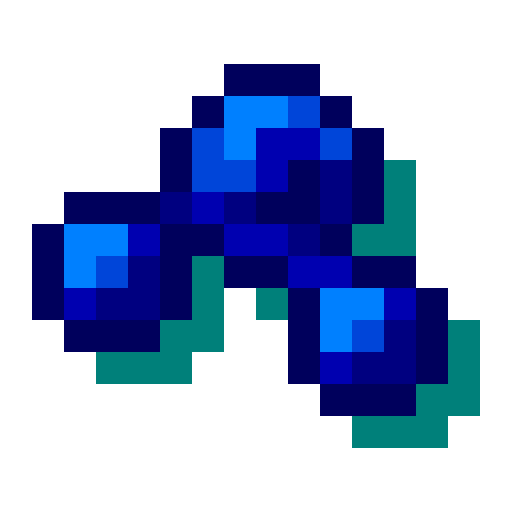

# Visuality Compat

Visuality Compat is a fork of [Visuality Reforged](https://github.com/DragonsPlusMinecraft/VisualityReforged) with added compatibility for other mods in the config by default. This is a simple client-sided cosmetic mod that will add a bunch of new
particles such as crystal sparkles, particles on mob hitting, custom blob particles for slimes, environmental particles
to your Minecraft world. Expect particles collection expanding with the mod updates!

## Configuration

You can configure the mod by editing visuality.json in the config folder of your Minecraft directory or simply through
ModMenu integration.

## Feedback

All feature requests should go to [Visuality](https://github.com/PinkGoosik/visuality).
All bug reports on Forge should go to Visuality Compat.

## Supported mods
[The Undergarden](https://www.curseforge.com/minecraft/mc-mods/the-undergarden) (1.0.0+)

[Mutant Monsters](https://www.curseforge.com/minecraft/mc-mods/mutant-monsters) (1.0.0+)
